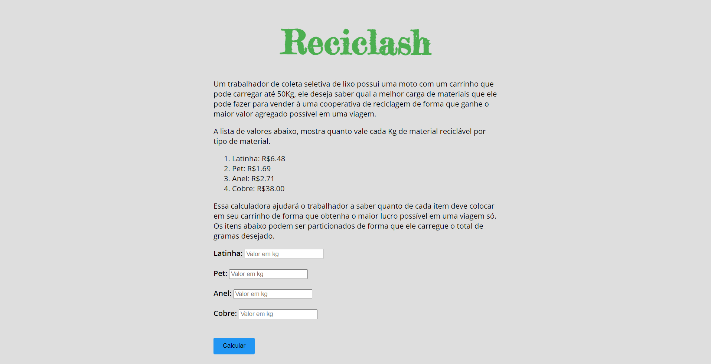
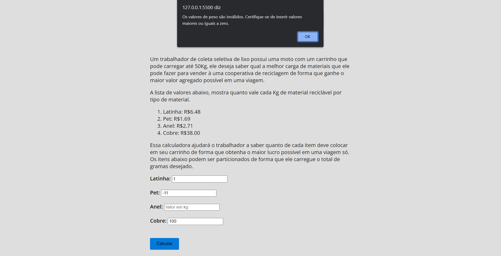
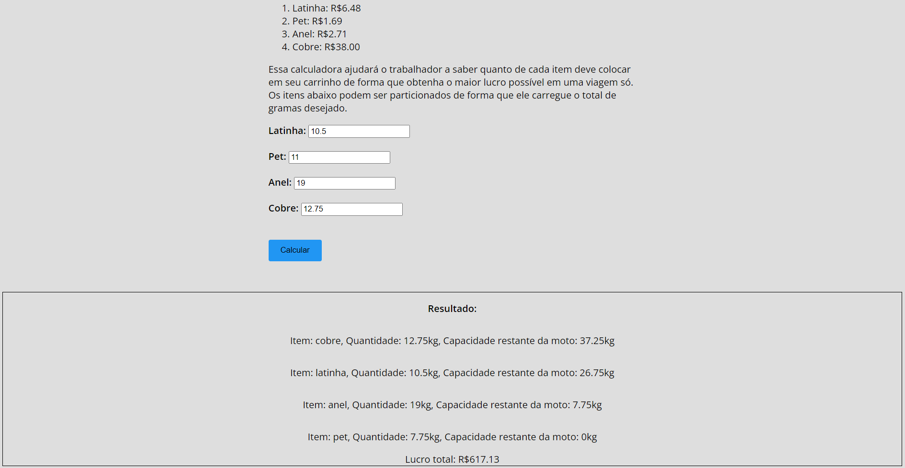

# Reciclash

**Número da Lista**: 41 
**Conteúdo da Disciplina**: Greed 

## Alunos
|Matrícula | Aluno |
| -- | -- |
| 16/0124581  |  Hugo Aragão de Oliveira|
| 20/2015984  |  Breno Henrique de Souza |

## Sobre 
O objetivo desse projeto é utilizar na prática o algoritmo Knapsack para
calcular a melhor distribuição de carga reciclável de modo que gere o maior
custo/benfício na venda desses materiais. 

## Screenshots
Tela inicial:

Tela com tratamente de erros:

Tela com resultado:

## Instalação 
**Linguagem**: Javascript 
**Framework**: Não foi utilizado 

Para rodar o projeto é necessário ter acesso a internet para clonar o repositório,
e ter um navegador instalado no computador(de preferência Chrome ou Edge), para rodar
o projeto localmente.

## Uso 
Clone o repositório e execute o server utilizando a extensão Live Server no seu VsCode.
A porta local é informada pela própria extensão quando executado.

Também é possível executar diretamente em seu navegador (caso tenha o projeto clonado em
sua máquina), apenas copiando o path do arquivo `index.html` e colando no navegador.

## Video da Apresentação  
[<img src="https://img.youtube.com/vi/NM-qwSLa1CY/maxresdefault.jpg%22%3E"](https://youtu.be/NM-qwSLa1CY)]

[Link do Vídeo](https://youtu.be/NM-qwSLa1CY)

